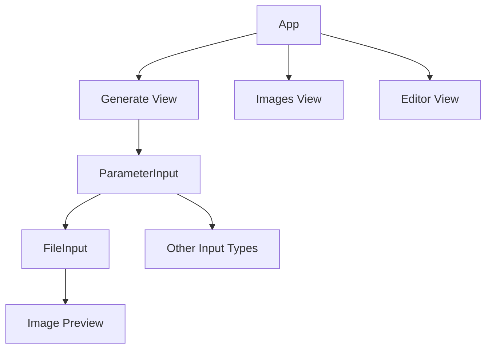
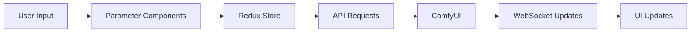

# System Patterns: AIRIS

## Architecture Overview

The application follows a clear separation of concerns with distinct frontend and backend components:

### Frontend Architecture

- React-based SPA with modular component structure
- Redux for state management
- WebSocket integration for real-time updates
- Component-specific CSS for styling

### Backend Architecture

- Python-based API server
- WebSocket server for real-time communication
- Integration with ComfyUI for image generation

## Key Components

### Parameter Input System

- Modular design supporting multiple parameter types
- Type-specific input components
- Unified parameter handling interface
- Special handling for seed parameters

### Image Handling System

- FileInput component for image upload and preview
- Integration with ParameterInput system
- File validation and error handling
- Planned ComfyUI image library integration
- Separate styling with FileInput.css

### Progress Tracking

- WebSocket-based real-time updates
- Global progress bar implementation
- Clean UI without percentage display

## Design Patterns

### Component Patterns

- Controlled components for form inputs
- Higher-order components for parameter type handling
- Composition over inheritance
- Reusable UI components

### State Management

- Redux for global state
- Local state for component-specific data
- WebSocket state synchronization

### Styling Patterns

- Component-specific CSS files
- Responsive design principles
- Mobile-first approach
- Consistent spacing and layout

## Component Relationships

### Frontend Components

### Data Flow

## Integration Points

### ComfyUI Integration

- Workflow execution
- Image generation
- Progress tracking
- Image library access

### WebSocket Communication

- Real-time progress updates
- Status notifications
- Error reporting

## Error Handling

### Input Validation

- Type-specific validation
- File size limits
- Format restrictions
- User feedback

### Runtime Errors

- API error handling
- WebSocket reconnection
- User notifications
